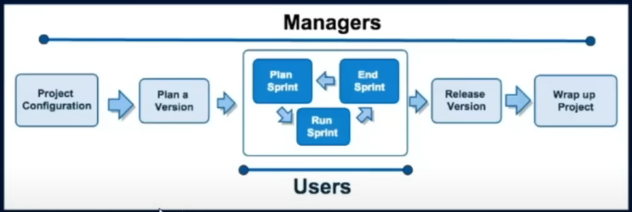
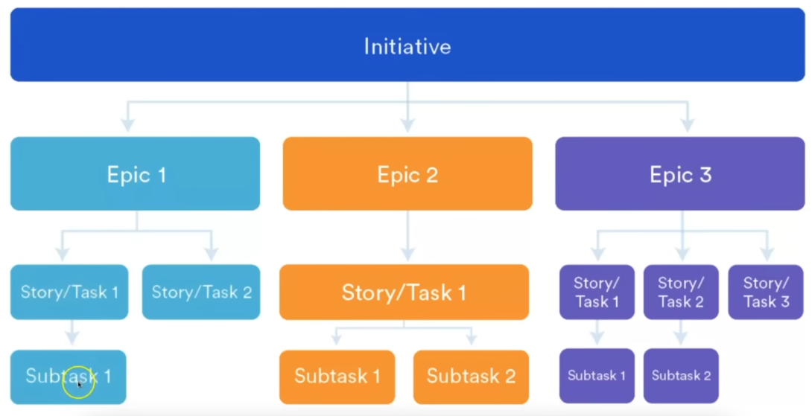

# Jira 

## **[Jira Learning Syllabus](./syllabus.md)**


## **[Know the Jargons/Terms First](./jargons.md)**

---

### Project Management



---

### Jira Instances

### **Jira Instances Explained (With Examples)**  

A **Jira Instance** refers to a unique installation or cloud-based setup of Jira used by a company, team, or project. It includes all projects, users, and data within that specific Jira environment.  

---

### **Types of Jira Instances**
1. **Jira Cloud Instance** – Hosted by Atlassian on the cloud. No manual server setup is needed.  
   - *Example: A startup uses `company.atlassian.net` to manage their projects on Jira Cloud.*  
2. **Jira Server Instance** – Installed on a company’s own servers. Offers more control and customization.  
   - *Example: A bank installs Jira on its internal servers for security reasons.*  
3. **Jira Data Center Instance** – A scalable, enterprise-level setup for large organizations with high availability.  
   - *Example: A multinational company with 10,000+ users uses Jira Data Center for better performance.*  

---

### **Jira Instance Examples**
- A software company might have a **Jira Cloud Instance** for managing feature development and bug tracking.  
- A government agency might use a **Jira Server Instance** for secure, on-premise project management.  
- A big e-commerce company might use a **Jira Data Center Instance** to handle multiple teams working on different projects simultaneously.  

---

### **How to Identify Your Jira Instance?**
- If your Jira URL looks like `yourcompany.atlassian.net`, it's **Jira Cloud**.  
- If you access Jira via an internal company network, it's **Jira Server** or **Data Center**.  

---

### **Agile and Agile Methodologies**  

#### **What is Agile?**  
Agile is a flexible and iterative approach to project management and software development. It focuses on delivering work in small, manageable parts and adapting to changes quickly based on feedback.  

---

### **Agile Methodologies & Frameworks**  

1. **Scrum Framework** 🏉  
   - Uses time-boxed iterations called **Sprints** (1-4 weeks).  
   - Roles: **Scrum Master**, **Product Owner**, and **Development Team**.  
   - Daily Standups (short meetings) to track progress.  
   - Uses a **Scrum Board** to manage tasks.  
   - *Example:* A software team working in 2-week sprints to build new features.  

2. **Kanban Framework** 📌  
   - Focuses on **visualizing work** and limiting the number of tasks in progress.  
   - Uses a **Kanban Board** with columns (To Do → In Progress → Done).  
   - Tasks move continuously without fixed sprints.  
   - *Example:* A support team managing customer tickets in real-time.  

3. **Extreme Programming (XP)** 💻  
   - Focuses on **high-quality code and fast releases**.  
   - Practices include **Test-Driven Development (TDD)** and **Pair Programming**.  
   - Frequent small releases and continuous customer feedback.  
   - *Example:* A team writes tests before coding to ensure reliability.  

4. **Lean Development** 🔄  
   - Inspired by **Lean Manufacturing (Toyota Production System)**.  
   - Focuses on **eliminating waste** and delivering value faster.  
   - Encourages minimal documentation and fast decision-making.  
   - *Example:* A startup using minimal processes to release software quickly.  

5. **Feature-Driven Development (FDD)** 🚀  
   - Focuses on **developing software based on features**.  
   - Uses short development cycles (2 weeks).  
   - Prioritizes domain modeling and clear design before coding.  
   - *Example:* A mobile app team adds small but valuable features in each release.  

6. **Crystal Methodology** ✨  
   - A **lightweight** Agile approach that adapts to team size and complexity.  
   - Encourages face-to-face communication and team flexibility.  
   - Variants: **Crystal Clear, Crystal Yellow, Crystal Orange** (based on team size).  
   - *Example:* A small startup team using minimal rules for faster development.  

---

### **Which Agile Framework Should You Choose?**  
- **Scrum** → Best for structured teams with well-defined roles.  
- **Kanban** → Best for teams handling continuous work (like support teams).  
- **XP** → Best for teams needing high-quality, bug-free code.  
- **Lean** → Best for startups focusing on quick development with minimal waste.  
- **FDD** → Best for teams working on feature-rich products.  
- **Crystal** → Best for small, highly flexible teams.  

---


### **The Scrum Framework – Explained Simply** 🏉  

Scrum is one of the most popular Agile frameworks used in project management and software development. It helps teams work efficiently by organizing tasks into small, time-boxed periods called **Sprints** (usually 1-4 weeks).  

---

## **🔹 Scrum Key Components**  

### **1️⃣ Scrum Roles**  
There are three main roles in Scrum:  

1. **Product Owner** 🏗️  
   - Defines the product vision.  
   - Prioritizes the backlog (list of tasks).  
   - Ensures the team works on the most valuable features first.  
   - *Example:* A product manager deciding which features are most important for the next release.  

2. **Scrum Master** 🏆  
   - Facilitates the Scrum process.  
   - Removes obstacles for the development team.  
   - Ensures the team follows Agile principles.  
   - *Example:* Helping the team unblock issues like missing resources or dependencies.  

3. **Development Team** 👨‍💻👩‍💻  
   - The people who actually work on the tasks (developers, designers, testers, etc.).  
   - Self-organizing, meaning they decide how to complete the work.  
   - *Example:* A team of developers coding new features for a mobile app.  

---

### **2️⃣ Scrum Events (Meetings & Cycles)**  

1. **Sprint Planning** 📅  
   - Before a sprint starts, the team selects tasks from the backlog.  
   - The team decides how much work they can complete in the sprint.  
   - *Example:* Deciding which features will be built in the next 2-week sprint.  

2. **Daily Scrum (Stand-up Meeting)** ⏳  
   - A short 15-minute meeting every day.  
   - Each team member answers:  
     1. What did I do yesterday?  
     2. What will I do today?  
     3. Any blockers (problems)?  
   - *Example:* A developer mentions they are stuck on a bug, and another teammate helps.  

3. **Sprint Review** 🎉  
   - At the end of a sprint, the team showcases completed work to stakeholders.  
   - Feedback is collected for future improvements.  
   - *Example:* A demo presentation of a new feature to managers and users.  

4. **Sprint Retrospective** 🔄  
   - The team reflects on what went well and what needs improvement.  
   - Action items are discussed to improve the next sprint.  
   - *Example:* If too many bugs appeared, the team decides to improve testing.  

---

### **3️⃣ Scrum Artifacts (Documents & Boards)**  

1. **Product Backlog** 📌  
   - A list of all tasks, features, and bugs for the product.  
   - Managed by the **Product Owner**.  
   - *Example:* A backlog containing tasks like "Add a login feature" and "Fix checkout bug."  

2. **Sprint Backlog** 🏃‍♂️  
   - A list of tasks selected for the current sprint.  
   - Managed by the **Development Team**.  
   - *Example:* Only 5 tasks from the product backlog are picked for a 2-week sprint.  

3. **Increment** ✅  
   - The sum of all completed tasks in a sprint that add value to the product.  
   - *Example:* After a sprint, a new "Dark Mode" feature is fully functional and ready for users.  

---

### **🔄 Scrum Workflow (How Work Moves)**  

1️⃣ **Product Owner** creates the **Product Backlog** (list of tasks).  
2️⃣ During **Sprint Planning**, the **Development Team** selects tasks for the **Sprint Backlog**.  
3️⃣ Every day, the team has a **Daily Scrum** to track progress.  
4️⃣ At the end of the sprint, the team presents the work in the **Sprint Review**.  
5️⃣ The **Sprint Retrospective** helps the team improve the next sprint.  
6️⃣ The process repeats! 🚀  

---

### **📌 Example: How Scrum Works in Real Life**  

📱 **Scenario:** A mobile app company wants to add a **Dark Mode** feature.  

- The **Product Owner** adds “Implement Dark Mode” to the **Product Backlog**.  
- During **Sprint Planning**, the team picks this task for the next sprint.  
- Every day, they discuss progress in the **Daily Scrum**.  
- After 2 weeks, they finish Dark Mode and showcase it in the **Sprint Review**.  
- In the **Sprint Retrospective**, they discuss making UI testing faster for future sprints.  

---

### **✅ Why Use Scrum?**  
✔ Helps teams stay **organized** and **focused**.  
✔ Allows for **quick changes** based on feedback.  
✔ Breaks big projects into **small, manageable** parts.  
✔ Keeps **everyone in sync** with daily updates.  

---

# **Scrum vs. Kanban – A Simple Comparison** 🏉📊  

Scrum and Kanban are both Agile frameworks used for project management, but they have key differences.  

| Feature        | **Scrum** 🏉 | **Kanban** 📊 |
|--------------|------------|------------|
| **Approach** | Iterative & structured | Continuous & flexible |
| **Work Style** | Fixed Sprints (1-4 weeks) | Continuous flow |
| **Team Roles** | Defined (Scrum Master, Product Owner, Developers) | No fixed roles (everyone manages workflow) |
| **Meetings** | Regular (Daily Standup, Sprint Review, Retrospective) | Optional (only if needed) |
| **Board Type** | Scrum Board (organized by sprints) | Kanban Board (tasks move freely) |
| **Work Limit** | Sprint Backlog limits work in a sprint | WIP (Work In Progress) limits for each column |
| **Planning** | Sprint Planning at the start | Continuous planning as needed |
| **Best for** | Teams working in iterations | Teams with continuous workflow (support, maintenance) |
| **Example Use Case** | Developing a new app feature | Managing customer support tickets |

---

## **1️⃣ Scrum Overview 🏉**
✅ Work is done in fixed-length **Sprints** (1-4 weeks).  
✅ Teams follow a **structured workflow** (Sprint Planning → Daily Standups → Sprint Review → Retrospective).  
✅ Best for **software development teams** working on new features.  

📌 **Example:** A mobile app team plans a 2-week sprint to develop a new login feature.  

---

## **2️⃣ Kanban Overview 📊**
✅ Tasks flow continuously without fixed-length sprints.  
✅ Uses **Work In Progress (WIP) Limits** to prevent overload.  
✅ Best for **support teams or teams with ongoing work** (e.g., bug fixes, DevOps).  

📌 **Example:** A customer support team handles tickets as they come in without sprint cycles.  

---

## **📌 When to Use Scrum vs. Kanban?**
- **Use Scrum** if your work has **clear deadlines and structured phases**.  
- **Use Kanban** if your work is **ongoing and requires flexibility**.  
- **Use Scrumban** (a mix of both) for teams that want **structured sprints but continuous workflow**.  

---

Here's a real-world example to help you understand **Scrum vs. Kanban** better.  

---

### **📌 Real-World Example: Developing & Maintaining a Mobile App**  

Imagine your team is working on a **mobile app**. You need to develop **new features** and also **fix bugs** as they arise.  

#### **1️⃣ Scrum for New Feature Development 🏉**  
🔹 Your team plans a **2-week Sprint** to add a **dark mode feature**.  
🔹 The work is broken into **User Stories** (e.g., “Allow users to switch to dark mode”).  
🔹 Every day, the team has a **Daily Standup** to discuss progress.  
🔹 At the end of 2 weeks, the feature is reviewed, tested, and released.  
🔹 The team holds a **Sprint Retrospective** to discuss improvements for the next sprint.  

💡 **Why Scrum?** The work is structured, planned in advance, and delivered in fixed cycles.  

---

#### **2️⃣ Kanban for Bug Fixes & Maintenance 📊**  
🔹 Bugs and issues are reported continuously by users.  
🔹 The team places them on a **Kanban Board** under “To Do.”  
🔹 They fix bugs one by one as per priority, moving tasks from **To Do → In Progress → Done**.  
🔹 No sprint deadlines – work flows as needed.  
🔹 If the team is overwhelmed, they reduce the **Work In Progress (WIP) limit** to stay focused.  

💡 **Why Kanban?** Bugs and maintenance tasks arrive unpredictably, so a **flexible approach** works better.  

---

### **📌 When to Use Scrumban?**  
🔹 Your team needs **structure for new features** (Scrum) but **flexibility for bug fixes** (Kanban).  
🔹 You plan sprints but also handle **urgent tasks** without waiting for the next sprint.  

🔥 **Example:**  
- Use **Scrum** for adding a new "Chat Feature" in a Sprint.  
- Use **Kanban** for handling **urgent security fixes** immediately.  


---

# **Sprint in Scrum – A Simple Guide 🚀**  

A **Sprint** is a short, time-boxed period (usually **1-4 weeks**) where a team completes a set of tasks. It's a **core concept of Scrum** and helps teams deliver work **quickly and consistently**.  

---

## **📌 Sprint Workflow (Step-by-Step)**  

1️⃣ **Sprint Planning** – Decide what tasks to work on in the sprint.  
2️⃣ **Daily Standups** – Short daily meetings to discuss progress.  
3️⃣ **Work Execution** – Team works on tasks from the Sprint Backlog.  
4️⃣ **Sprint Review** – At the end, the team showcases the completed work.  
5️⃣ **Sprint Retrospective** – Discuss what went well and what can be improved.  
6️⃣ **Next Sprint Starts** – The cycle repeats with a new Sprint.  

---

## **📌 Key Sprint Terms**  

- **Sprint Backlog** – List of tasks to complete in a Sprint.  
- **Sprint Goal** – The main objective of the Sprint.  
- **Time-boxed** – Fixed duration (e.g., 2 weeks).  
- **Increment** – The final product or feature delivered.  
- **Burn-down Chart** – A graph showing remaining work vs. time.  

---

## **📌 Example: Mobile App Sprint** 📱  

🔹 **Sprint Goal** – Add a "Dark Mode" feature.  
🔹 **Sprint Backlog** –  
   - Design dark mode UI  
   - Implement toggle button  
   - Test across devices  
   - Fix reported issues  

🔹 **Daily Standups** – Team checks progress every morning.  
🔹 **Sprint Review** – Show the working "Dark Mode" feature.  
🔹 **Sprint Retrospective** – Discuss what went well & improve for next Sprint.  

💡 **Sprints ensure fast, focused, and frequent software releases!**  

---

# **Epic & Roadmap/Timeline – A Simple Guide 🚀**  

## **📌 What is an Epic?**  
An **Epic** is a **big feature or project** that is too large to complete in one sprint. It is broken down into **smaller user stories** and tasks.  

### **Example:**  
📱 **Epic:** "Build a Chat Feature for a Mobile App"  
🔹 **Story 1:** "Design the chat UI"  
🔹 **Story 2:** "Implement real-time messaging"  
🔹 **Story 3:** "Add push notifications"  

👉 **Epics help teams manage large projects by breaking them into smaller, manageable parts.**  

---

## **📌 What is a Roadmap/Timeline?**  
A **Roadmap** (or **Timeline**) is a **visual plan** that shows when different epics, stories, and tasks will be completed.  

### **Example of a Roadmap (3 Months Plan) 🗓️**  

| Month | Epic | Tasks |
|--------|------|-------|
| **March** | "User Authentication" | Login, Signup, Google OAuth |
| **April** | "Chat Feature" | UI, Real-time Messaging, Notifications |
| **May** | "Dark Mode & Performance Improvements" | Dark UI, Speed Optimization |

👉 **A roadmap helps teams track progress and align work with business goals.**  

---

# **Story vs. Task vs. Issue vs. Bug – A Simple Guide 🚀**  

In **Jira** and project management, these terms help categorize different types of work. Let’s break them down with **examples** so you can understand them easily.  

---

## **📌 1. Story (User Story) – A Feature Request**  
A **Story** describes a feature from the user’s perspective. It answers: **"What does the user need?"**  

✅ **Example:**  
- 🛒 "As a user, I want to add items to my cart so I can purchase them later."  
- 🔹 Stories are usually part of a bigger **Epic** (e.g., "Build an E-commerce Website").  
- 🔹 Stories are broken into **Tasks**.  

---

## **📌 2. Task – A Piece of Work to Do**  
A **Task** is an action item that must be completed. It is **smaller than a Story** and is assigned to a team member.  

✅ **Example:**  
- 🎨 "Design the cart UI."  
- 🖥️ "Develop the cart functionality."  
- ✅ "Write test cases for the cart feature."  

🔹 **Tasks can exist independently or be part of a Story.**  

---

## **📌 3. Issue – A General Work Item**  
In Jira, **Issue** is a broad term that can refer to **a Story, Task, or Bug**.  

✅ **Example:**  
- "Implement dark mode" (Story)  
- "Fix checkout page alignment" (Bug)  
- "Upgrade the server" (Task)  

🔹 **In simple terms, every work item in Jira is called an Issue.**  

---

## **📌 4. Bug – A Problem or Error in the System**  
A **Bug** is an issue that needs fixing because something is not working as expected.  

✅ **Example:**  
- ❌ "Checkout button is not working on mobile."  
- 🛑 "App crashes when clicking on the profile page."  
- ⚠️ "Images are loading slowly on the homepage."  

🔹 **Bugs must be prioritized based on severity:**  
  - 🟥 **Critical** – App crashes, security issues.  
  - 🟧 **High** – Major function not working.  
  - 🟨 **Medium** – Minor bugs affecting usability.  
  - 🟩 **Low** – Cosmetic issues (e.g., UI misalignment).  

---

## **📌 Simple Workflow in Jira: How They Connect**  

1️⃣ **Epic**: "Build a Chat Feature"  
2️⃣ **Story**: "Enable users to send messages."  
3️⃣ **Tasks**: "Create UI," "Develop backend," "Add typing indicators."  
4️⃣ **Bugs**: "Messages sometimes fail to send."  

💡 **Understanding these terms helps teams work efficiently in Agile & Scrum!**  

---

# **Hierarchy of Work Items in Jira & Agile 🚀**  

Understanding the hierarchy of **Epics, Stories, Tasks, Issues, and Bugs** is key to managing projects effectively. Here's a simple breakdown:  

---

## **📌 Jira Work Item Hierarchy (Top to Bottom)**
```
1️⃣ Initiative (Optional - Large Business Goal)
    └── 2️⃣ Epic (Big Feature or Project)
         ├── 3️⃣ Story (Feature or User Requirement)
         │    ├── 4️⃣ Task (Work Item to Complete the Story)
         │    └── 4️⃣ Bug (Issue that Needs Fixing)
         └── 3️⃣ Sub-task (Smaller Part of a Task)
```

---

## **📌 Explanation with Example (E-commerce App)**
| Level | Work Item | Example |
|--------|-------------|--------------------------------|
| **1️⃣ Initiative** _(Optional)_ | "Improve Shopping Experience" | A company-wide goal |
| **2️⃣ Epic** | "Build a Checkout System" | A major feature |
| **3️⃣ Story** | "As a user, I want to apply discount codes" | A feature request |
| **4️⃣ Task** | "Develop discount logic in backend" | A specific piece of work |
| **4️⃣ Bug** | "Discount code not applying correctly" | A problem to fix |
| **4️⃣ Sub-task** | "Write unit tests for discount logic" | A small work item within a Task |

---

## **📌 Visualizing the Hierarchy**
```
📌 Initiative: "Improve Shopping Experience"
    └── 📌 Epic: "Build a Checkout System"
        ├── 📌 Story: "As a user, I want to apply discount codes"
        │    ├── ✅ Task: "Develop discount logic in backend"
        │    ├── 🛠️ Sub-task: "Write unit tests for discount logic"
        │    └── 🐞 Bug: "Discount code not applying correctly"
        └── 📌 Story: "As a user, I want to pay with PayPal"
             ├── ✅ Task: "Integrate PayPal API"
             └── 🐞 Bug: "Payment fails for some users"
```

---

## **📌 Simple Rules to Remember**
- **Initiative** → A broad company goal (optional in Jira).  
- **Epic** → A big feature or project that spans multiple sprints.  
- **Story** → A specific feature request from a user.  
- **Task** → A piece of work that contributes to completing a Story.  
- **Bug** → A problem that needs fixing in the system.  
- **Sub-task** → A smaller work item within a Task.  

💡 **Epics contain Stories, Stories contain Tasks, and Bugs/Tasks may have Sub-tasks.**  




---

# **📌 Backlog vs. Sprint – Simple Explanation 🚀**  

## **1️⃣ What is a Backlog? (To-Do List for Future Work)**
- The **Backlog** is a list of all tasks, stories, and bugs that need to be done in the future.  
- It is **not assigned to any specific time frame** yet.  
- The team picks tasks from the Backlog for upcoming **Sprints**.  

✅ **Example:**  
Imagine you are developing a social media app. Your **Backlog** may have:  
- 📌 "Add dark mode" (Story)  
- 📌 "Fix login issue" (Bug)  
- 📌 "Improve profile page design" (Task)  

---

## **2️⃣ What is a Sprint? (Work Done in a Fixed Time)**  
- A **Sprint** is a short time period (usually **1-4 weeks**) where the team works on selected tasks from the **Backlog**.  
- Once a Sprint starts, the tasks inside it **must be completed before the Sprint ends**.  
- Sprints help teams **stay focused** and deliver small, working features regularly.  

✅ **Example:**  
Sprint **(Feb 26 - Mar 10)** 🏃‍♂️  
✔️ "Fix login issue" (Bug)  
✔️ "Improve profile page design" (Task)  

---

## **📌 Key Differences**
| Feature | **Backlog** | **Sprint** |
|----------|------------|------------|
| **What is it?** | A list of all upcoming tasks | A set of tasks planned for a short time (1-4 weeks) |
| **Timeframe?** | No fixed time | Fixed duration (1-4 weeks) |
| **Can tasks change?** | Yes, new items can be added | No, once Sprint starts, changes should be minimal |
| **Used for?** | Storing and prioritizing work | Completing specific tasks in a short time |

---

## **📌 How Backlog & Sprint Work Together?**
1️⃣ **Product Owner** adds features, bugs, and improvements to the **Backlog**.  
2️⃣ During **Sprint Planning**, the team picks tasks from the **Backlog** and moves them into the **Sprint**.  
3️⃣ Team works on the **Sprint** tasks until they are completed.  
4️⃣ If some tasks are **not finished**, they move back to the **Backlog** for future Sprints.  

---

💡 **Think of Backlog as a TODO list and Sprint as the tasks you commit to doing this week!** 🚀

---

# **🔍 Search in Jira & Its Types**  

Jira provides powerful search options to find issues, tasks, and bugs easily. There are two main types of search:  

---

## **1️⃣ Basic Search (Simple & User-Friendly)**
- **Best for Beginners** ✅  
- Uses **dropdown filters** to search for issues without writing queries.  
- You can filter by:  
  - **Project** (e.g., "E-commerce App")  
  - **Issue Type** (Story, Task, Bug, etc.)  
  - **Status** (To Do, In Progress, Done)  
  - **Assignee** (Who is working on it?)  
  - **Priority** (High, Medium, Low)  
  - **Labels & Components**  

✅ **Example:**  
👉 You want to find all **open bugs** in "Mobile App Project".  
- Go to Jira → Issues → Search  
- Select **Project = Mobile App Project**  
- Select **Issue Type = Bug**  
- Select **Status = Open**  
- ✅ See the list of open bugs!  

---

## **2️⃣ Advanced Search (JQL - Jira Query Language)**
- **Best for Advanced Users & Complex Queries** 🚀  
- Uses **JQL (Jira Query Language)** to find issues with custom conditions.  
- **More powerful than Basic Search** because you can use logical conditions like `AND`, `OR`, `ORDER BY`, etc.  

✅ **Example Queries:**  
1️⃣ **Find all open bugs in a project:**  
```jql
project = "Mobile App" AND issuetype = Bug AND status = Open
```
2️⃣ **Find all tasks assigned to "John" that are high priority:**  
```jql
assignee = John AND priority = High AND status != Done
```
3️⃣ **Find all issues updated in the last 7 days:**  
```jql
updated >= -7d
```

---

## **3️⃣ Quick Search (Fast & Easy)**
- **Best for finding a specific issue quickly** 🔍  
- Located at the **top-right corner** in Jira.  
- Just type an **issue key** (like `PROJ-123`), **summary**, or **assignee name** to find it instantly.  

✅ **Example:**  
- You type `Login Bug` in Quick Search → Jira shows related issues instantly!  

---

## **4️⃣ Saved & Filtered Search (For Repeated Searches)**
- If you **frequently** search for specific issues, you can **save your search filters**.  
- This helps teams quickly check progress on bugs, sprints, etc.  
- You can also **share filters** with your team.  

✅ **Example:**  
- You want to **track all unresolved bugs** daily.  
- Create a search in JQL:  
  ```jql
  project = "E-commerce App" AND issuetype = Bug AND resolution = Unresolved
  ```
- Save the filter → Now, you can check it anytime with **one click!**  

---

## **📌 Summary of Search Types in Jira**
| **Search Type** | **Best For** | **How It Works** |
|----------------|-------------|------------------|
| **Basic Search** | Beginners | Uses filters like Project, Status, Assignee |
| **Advanced Search (JQL)** | Complex queries | Uses Jira Query Language (JQL) for custom searches |
| **Quick Search** | Fast lookups | Search by issue key, assignee, or summary |
| **Saved & Filtered Search** | Repeated searches | Save queries and use them anytime |

---

💡 **Tip:** If you're new to Jira, start with **Basic Search**. Once you're comfortable, try **JQL** for more advanced queries! 🚀

---

# **🔍 Advanced Search in Jira (JQL - Jira Query Language)**  

JQL (Jira Query Language) is a powerful way to search and filter issues in Jira using structured queries. It allows for **custom, precise, and complex searches** that go beyond Basic Search.  

---

## **1️⃣ JQL Syntax Basics**
A JQL query follows this structure:  
```jql
<field> <operator> <value>
```
✅ **Example:** Find all open bugs  
```jql
issuetype = Bug AND status = Open
```

### **Common Elements in JQL**  
| **Element**  | **Examples** | **Description** |
|-------------|-------------|----------------|
| **Fields** | `project`, `status`, `priority`, `assignee` | Defines what you’re searching for |
| **Operators** | `=`, `!=`, `>`, `<`, `IN`, `AND`, `OR` | Used to filter results |
| **Values** | `"Mobile App"`, `Open`, `High` | The actual value you are searching for |
| **Functions** | `now()`, `startOfWeek()`, `endOfMonth()` | Dynamic values |

---

## **2️⃣ Common JQL Queries**
### **1. Find all open tasks in a project**
```jql
project = "E-commerce App" AND status != Done
```

### **2. Find all high-priority bugs assigned to a specific user**
```jql
issuetype = Bug AND priority = High AND assignee = "John Doe"
```

### **3. Find tasks updated in the last 7 days**
```jql
updated >= -7d
```

### **4. Find issues created this month**
```jql
created >= startOfMonth()
```

### **5. Find all issues assigned to me**
```jql
assignee = currentUser()
```

### **6. Find issues in multiple projects**
```jql
project IN ("App A", "App B") AND status = Open
```

### **7. Find all tasks that are not bugs**
```jql
issuetype != Bug
```

### **8. Find issues that are in progress or in review**
```jql
status IN ("In Progress", "In Review")
```

### **9. Find issues that are overdue (due date has passed)**
```jql
duedate < now()
```

### **10. Find issues that were completed last week**
```jql
status = Done AND resolved >= startOfWeek(-1) AND resolved <= endOfWeek(-1)
```

---

## **3️⃣ Advanced JQL Operators**
| **Operator** | **Meaning** | **Example** |
|-------------|------------|-------------|
| `=` | Equals | `status = "In Progress"` |
| `!=` | Not Equals | `priority != Low` |
| `>` | Greater Than | `created > "2024-01-01"` |
| `<` | Less Than | `updated < -7d` |
| `>=` | Greater Than or Equal | `priority >= High` |
| `<=` | Less Than or Equal | `duedate <= now()` |
| `IN` | Matches Any Value in a List | `status IN ("Open", "To Do")` |
| `NOT IN` | Excludes Values from List | `status NOT IN ("Done", "Closed")` |
| `IS` | Checks for Empty Fields | `resolution IS EMPTY` |
| `ORDER BY` | Sorts Results | `ORDER BY created DESC` |

---

## **4️⃣ Using JQL for Agile Boards & Reports**
- **Filter Sprint Issues:**  
  ```jql
  sprint = "Sprint 5"
  ```
- **Show Completed Tasks in Current Sprint:**  
  ```jql
  sprint IN openSprints() AND status = Done
  ```
- **Find Unassigned Tasks in the Backlog:**  
  ```jql
  project = "Website Redesign" AND assignee IS EMPTY AND status = "Backlog"
  ```

---

## **🎯 Summary**
| **Feature** | **Basic Search** | **JQL (Advanced Search)** |
|------------|----------------|------------------|
| **Best For** | Simple filters | Complex queries |
| **Flexibility** | Limited | Highly flexible |
| **Operators** | Dropdown selection | Use `=`, `IN`, `ORDER BY`, etc. |
| **Examples** | Filter by project, status | Find all high-priority bugs assigned to John |

---

🚀 **Pro Tip:** Start with **Basic Search**, then explore **JQL** to create advanced reports, track progress, and improve workflow automation!

---

### **📌 Labels in Jira**  
- **Definition**: Tags or keywords that help organize and categorize issues.  
- **Use Case**: Helps in filtering and searching similar tasks across multiple projects.  
- **Example**:  
  - A bug related to login issues can have labels: `login`, `auth`, `critical`.  
  - A feature request can have labels: `UI`, `enhancement`, `high-priority`.  

---

### **⭐ Story Points in Jira**  
- **Definition**: A measure of effort/complexity required to complete a task (used in Agile).  
- **Use Case**: Helps estimate workload in Sprints, not based on time but effort.  
- **Example Scale**:  
  - **1 Point** → Simple UI change  
  - **3 Points** → Medium complexity, needs backend updates  
  - **8 Points** → Large feature, multiple dependencies  
  - **13+ Points** → Very complex, may need splitting into smaller tasks  

📌 **Story points ≠ Hours**, they indicate **relative effort**! 🚀

---

### **📝 Issue Activity vs. Activity Stream in Jira**  

#### **📌 Issue Activity**  
- **Definition**: Tracks all updates related to a specific issue.  
- **Where?** Found inside an issue under the "Activity" section.  
- **Includes**:  
  - Comments  
  - Status changes (To Do → In Progress → Done)  
  - Assignee updates  
  - Work logs  
  - Attachments added  
  - Linked issues  

✅ **Example**: If a bug is assigned to a new developer, its **Issue Activity** will show:  
*"Assignee changed from John to Alice on Feb 26, 2025."*  

---

#### **📡 Activity Stream**  
- **Definition**: A real-time feed showing updates across multiple issues, projects, or teams.  
- **Where?** Found in the **Dashboard** under "Activity Stream."  
- **Includes**:  
  - All issue activities (comments, status updates, new issues)  
  - Project-wide changes  
  - Sprint progress  
  - Worklog entries  

✅ **Example**: If three different developers update three separate issues, the **Activity Stream** will show all those changes in one place.

📌 **Key Difference**:  
| Feature  | Issue Activity  | Activity Stream  |
|----------|----------------|------------------|
| **Scope** | Single Issue | Multiple Issues & Projects |
| **Location** | Inside an issue | Dashboard & Widgets |
| **Filters** | Specific to one issue | Can be customized to show specific projects, users, etc. |

🚀 **Use Issue Activity for deep issue tracking & Activity Stream for an overview of all project changes!**

---

### **📊 Jira Reports & Charts: Types & Uses**  

Jira provides different types of **reports and charts** to help teams track progress, manage sprints, analyze issues, and improve efficiency.  

---

## **📈 Types of Charts in Jira Reports**  

### **1️⃣ Agile Reports & Charts (For Scrum & Kanban)**  
Used for tracking sprint progress, backlog health, and team efficiency.  

- **📉 Sprint Burndown Chart** → Shows the remaining work in a sprint over time. Helps teams check if they are on track.  
- **📈 Sprint Burnup Chart** → Shows work completed vs. the total work planned. Useful for tracking scope changes.  
- **🚀 Velocity Chart** → Measures how much work (story points) a team completes per sprint. Helps in sprint planning.  
- **🔄 Cumulative Flow Diagram** → Displays the number of issues in different workflow stages (To Do, In Progress, Done). Helps Kanban teams identify bottlenecks.  
- **🚦 Control Chart** → Tracks the cycle time (how long issues take to complete). Helps analyze team performance.  
- **📊 Epic Burndown Chart** → Tracks the progress of an **Epic** over time, helping teams break down large features.  
- **📍 Release Burndown Chart** → Shows the progress toward completing a **release** (version). Helps in **predicting release dates**.  

---

### **2️⃣ Issue Tracking & Performance Reports**  
Used for monitoring issue resolution, tracking bugs, and managing workloads.  

- **🐞 Created vs. Resolved Issues Chart** → Compares the number of issues created vs. those resolved over time.  
- **📆 Average Age Chart** → Shows the average age of unresolved issues. Helps identify long-standing issues.  
- **⚡ Resolution Time Chart** → Displays how long it takes to resolve issues on average. Helps measure efficiency.  
- **📋 Pie Chart Report** → Breaks down issues based on category, assignee, priority, or status.  
- **📊 Workload Report** → Shows issue distribution among team members. Helps balance workloads.  
- **⏳ Time Tracking Report** → Compares **estimated time** vs. **actual time spent** on tasks.  

---

### **3️⃣ Forecasting & Project Management Reports**  
Used for planning, roadmap visualization, and workload distribution.  

- **🛤 Roadmap Report** → Shows high-level project timelines and planned work.  
- **📍 Version Report** → Tracks the progress of work assigned to a specific release version.  
- **⚖ Workload Pie Chart** → Displays how tasks are distributed among team members. Helps prevent overload.  
- **📆 Time Since Issues Report** → Tracks how long issues have been open, updated, or in a specific status.  

---

## **📌 How to Use Charts in Jira?**  
1️⃣ **Go to the Project Dashboard** → Click **"Reports"** in the sidebar.  
2️⃣ **Select a Report Type** (Agile, Issue Tracking, or Forecasting).  
3️⃣ **Apply Filters** (Sprint, Assignee, Date Range, etc.).  
4️⃣ **Analyze & Improve** → Use the insights to refine workflows, allocate resources, and enhance productivity.  

📌 **Scrum Teams** → Use **Burndown, Velocity, Sprint Reports**.  
📌 **Kanban Teams** → Use **Cumulative Flow, Control Charts**.  
📌 **Project Managers** → Use **Roadmap, Workload, and Time Tracking Reports**.  

---

### **📊 Velocity Reports in Jira**  

A **Velocity Report** in Jira helps Agile teams measure how much work they complete in each sprint. It is mainly used in **Scrum** to track team progress and improve future sprint planning.  

---

## **🚀 What is Velocity in Jira?**  
- Velocity = **Total story points (or tasks) completed in a sprint**  
- It helps teams predict **how much work they can complete in future sprints**.  
- Higher velocity means faster delivery, while low/unstable velocity signals workflow issues.  

---

## **📈 How to Read a Velocity Report?**  

A **Velocity Chart** in Jira consists of:  
- **X-Axis (Sprints)** → Past sprints where work was completed.  
- **Y-Axis (Story Points / Tasks)** → Amount of work completed per sprint.  
- **Two Bars Per Sprint:**  
  - **Grey Bar (Committed Work)** → Story points estimated at the start of the sprint.  
  - **Green/Blue Bar (Completed Work)** → Story points actually finished by the end of the sprint.  

🚨 **If the completed work is consistently lower than committed work, the team may be overestimating capacity.**  

---

## **📌 How to Use a Velocity Report?**  

1️⃣ **Go to Your Scrum Project** → Click **Reports**.  
2️⃣ Select **Velocity Chart**.  
3️⃣ Adjust the filter (Sprint Range, Team, Board).  
4️⃣ Analyze past sprints → Identify patterns to improve sprint planning.  

---

## **✅ How to Improve Sprint Velocity?**  
✔ Estimate tasks better (avoid overcommitment).  
✔ Remove blockers slowing the team down.  
✔ Improve backlog grooming for better prioritization.  
✔ Avoid assigning too many new tasks mid-sprint.  

---

📌 **Velocity Reports are best for:**  
- **Sprint Planning** → Predict how much work can be taken in future sprints.  
- **Performance Tracking** → Measure if the team is improving or facing issues.  
- **Capacity Planning** → Adjust workload based on past performance.  

---